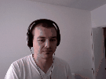

# GIF PLAY

A collection of random reshufflings and mixups of animated GIF frames for revisit.link

### Original example images

### Shuffle

Simple shuffle of the image frames

### Ping Pong

Image plays forward then backward, effectively turning every gif into DATLOOP

### SloMo

By adding 250ms of delay to every 3rd frame, you produce a faux "slow motion" effect

